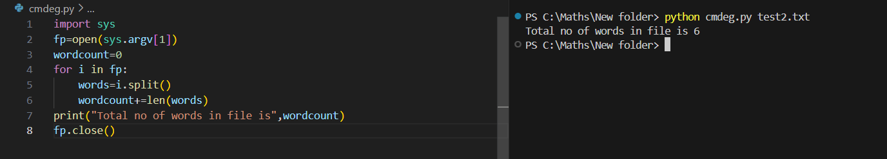

# Command--line-arguments-to-count-word
## AIM:
To write a python program for getting the word count from the contents of a file using command line arguments.
## EQUIPEMENT'S REQUIRED: 
PC
Anaconda - Python 3.7
## ALGORITHM: 
### Step 1:
import sys module for cmd line arguments
### Step 2: 
open the file which is passed in the argument
### Step 3: 
set word count as zero
### Step 4:  
use the split() function to get the seperate words
### Step 5: 
add them to the number of words
### Step 6: 
Display the number of words and end the program 
## PROGRAM:
```
Developed By: Priyadharshan S
Reference No.: 212223240127
import sys
fp=open(sys.argv[1])
wordcount=0
for i in fp:
    words=i.split()
    wordcount+=len(words)
print("Total no of words in file is",wordcount)
fp.close()
```
### OUTPUT:



## RESULT:
Thus the program is written to find the word count from the contents of a file using command line arguments.
